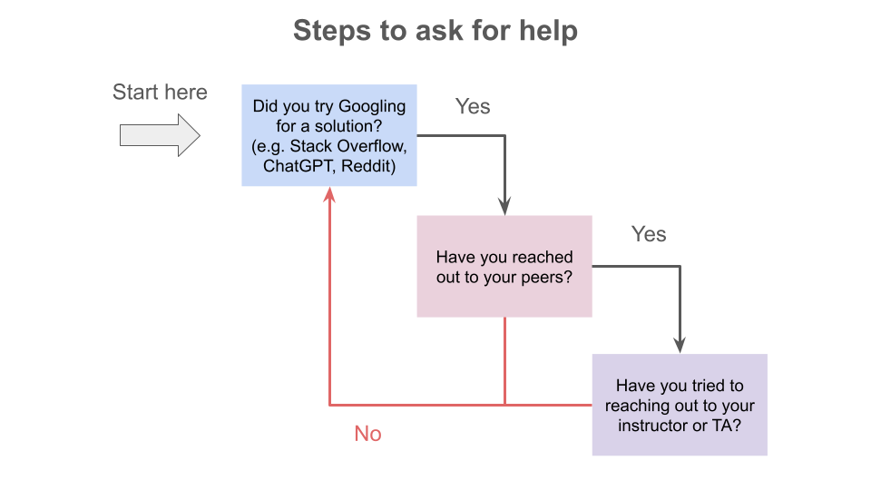

# Production

## Content
* [Description](#description)
* [Learning Outcomes](#learning-outcomes)
* [Assignments](#assignments)
* [Contacts](#contacts)
* [Delivery of the Learning module](#delivery-of-the-learning-module)
* [Schedule](#schedule)
* [Requirements](#requirements)
* [Resources](#resources)
  + [Documents](#documents)
  + [Videos](#videos)
  + [How to get help](#how-to-get-help)
* [Folder Structure](#folder-structure)
* [Acknowledgement](#acknowledgement)


## Description

This module provides an overview of the Design of Machine Learning Systems which are embedded within data-intensive products and applications. It covers the fundamental components of the infrastructure, systems, and methods necessary to implement and maintain Machine Learning (ML) models in production. In short, we will learn methods to build a factory of ML models. 

The module has two components: 

+ A discussion of the main issues and challenges faced in production, together with some approaches to address them.
+ A live lab with demonstrations of implementation techniques. 

The module covers the following areas:

+ Data engineering.
+ Feature engineering.
+ Hyperparameter tuning.
+ Model deployment.
+ Model explainability.
+ Logging, experiment tracking, and monitoring.

We will discuss the tools and techniques required to do the above in good order and at scale. However, we will not discuss the inner working of models, advantages, and so on. As well, we will not discuss the theoretical aspects of feature engineering or hyperparameter tuning. We will focus on tools and reproducibility.

## Learning Outcomes

By the end of this module, participants will be able to:

+ Describe the main components of a machine learning system.
+ Explain the infrastructure required to train and test models in production.
+ Implement an experiment tracking system and logging.
+ Contrast and evaluate different approaches of storing and manipulating data.
+ Design data flows and processes to automate the construction of ML models.

## Assignments

+ [Assignment](https://github.com/UofT-DSI/production/blob/main/02_activties/assignments/assignment_1.ipynb) 1 due on TBD.
+ [Assignment 2](https://github.com/UofT-DSI/production/blob/main/02_activties/assignments/assignment_2.ipynb) due on TBD.
+ [Assignment 3](https://github.com/UofT-DSI/production/blob/main/02_activties/assignments/assignment_3.ipynb) due on TBD.

## Contacts

**Questions can be submitted to the _#cohort-3-help_ channel on Slack**

* Technical Facilitator: 
  * name and pronouns: `<Name>`, `<Pronouns>` 
  * email: `<first_name.last_name@mail.ca>`
* Learning Support Staff: 
  * name and pronouns: `<Name>`, `<Pronouns>` 
  * email: `<first_name.last_name@mail.ca>`

## Delivery of the Learning Module

This module will include live learning sessions and optional, asynchronous work periods. During live learning sessions, the Technical Facilitator will introduce and explain key concepts and demonstrate core skills. Learning is facilitated during this time. Before and after each live learning session, the instructional team will be available for questions related to the core concepts of the module. Optional work periods are to be used to seek help from peers, the Learning Support team, and to work through the homework and assignments in the learning module, with access to live help. Content is not facilitated, but rather this time should be driven by participants. We encourage participants to come to these work periods with questions and problems to work through. 
 
Participants are encouraged to engage actively during the learning module. They key to developing the core skills in each learning module is through practice. The more participants engage in coding along with the instructional team, and applying the skills in each module, the more likely it is that these skills will solidify. 

# Schedule

|Live Learning Session |Date        |Topic                             |
|-----|------------|----------------------------------|
|  1  | TBD        | ML System Design                 |
|  2  | TBD        | Data Engineering Fundamentals    |
|  3  | TBD        | Working with Training Data       |
|  4  | TBD        | Feature Engineering              |
|  5  | TBD        | Model Development and Evaluation |
|  6  | TBD        | Deployment and Model Explanations|

### Requirements

* Participants are not expected to have any coding experience; the learning content has been designed for beginners.
* Participants are encouraged to ask questions, and collaborate with others to enhance their learning experience.
* Participants must have a computer and an internet connection to participate in online activities.
* Participants must have VSCode installed with the following extensions: 
    * [Jupyter](https://marketplace.visualstudio.com/items?itemName=ms-toolsai.jupyter)
    * [Python](https://marketplace.visualstudio.com/items?itemName=ms-python.python)
* Participants must install Docker as this module implements a Docker backend that will run a PosgreSQL server. This is intended to mimic a production-like environment. Participants may use SQLite if Docker is not an option.
* Participants must not use generative AI such as ChatGPT to generate code in order to complete assignments. It should be used as a supportive tool to seek out answers to questions you may have.
* We expect participants to have completed the steps in the [onboarding repo](https://github.com/UofT-DSI/onboarding/).
* We encourage participants to default to having their camera on at all times, and turning the camera off only as needed. This will greatly enhance the learning experience for all participants and provides real-time feedback for the instructional team. 

## Resources
Feel free to use the following as resources:

### Documents
- [Docker Installation](https://docs.docker.com/engine/install/)
- [Cheatsheet](https://docs.docker.com/get-started/docker_cheatsheet.pdf)

### Videos
- [What is Docker?](https://www.youtube.com/watch?v=Gjnup-PuquQ)
- [Docker Playlist](https://www.youtube.com/playlist?list=PLe4mIUXfbIqaYmsoFahYCbijPU4rjM38h)

### How to get help


<hr>

## Folder Structure

```markdown
.
├── .github
├── 01_materials
├── 02_activities
├── 03_instructional_team
├── 04_cohort_three
├── 05_src
├── .gitignore
├── LICENSE
├── README.md
└── steps_to_ask_for_help.png
```

* **.github**: Contains issue templates and pull request templates for the repository.
* **materials**: Module slides and interactive notebooks (.ipynb files) used during learning sessions.
* **activities**: Contains graded assignments, exercises, and homework to practice concepts covered in the learning module.
* **instructional_team**: Resources for the instructional team.
* **cohort_three**: Additional materials and resources for cohort three.
* **src**: Source code, databases, logs, and required dependencies (requirements.txt) needed during the module.
* **.gitignore**: Files to exclude from this folder, specified by the Technical Facilitator
* **LICENSE**: The license for this repository.
* **README**: This file.
* **steps_to_ask_for_help.png**: Guide on how to ask for help.
