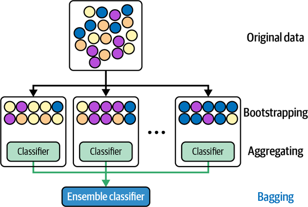
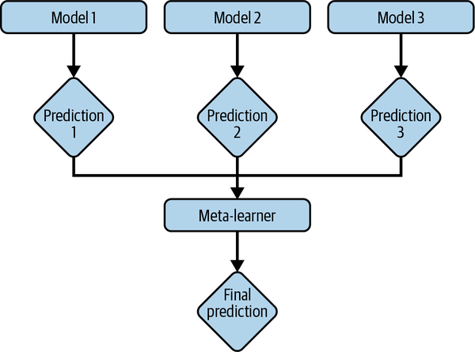

## Agenda

::::::{.columns}
:::{.column}

**5.1 Model Development and Offline Evaluation**

+ Model Development and Training 
+ Ensembles 
+ Experiment Tracking and Versioning 
+ Distributed Training
+ AutoML 
+ Model Offline Evaluation 

:::
:::{.column}

**5.2 Experiment Tracking**

+ Observability and telemetry
+ Docker and Portability
+ Experiment Tracking in Python
+ Experiment Components

:::
::::::

## About These Notes

::::::{.columns}
:::{.column}

These notes are based on Chapters 5 of [*Designing Machine Learning Systems*](https://huyenchip.com/books/), by [Chip Huyen](https://huyenchip.com/).

:::
:::{.column}

:::
::::::

# Model Development and Training 

## Evaluating ML Models

::::::{.columns}
:::{.column}

+ Evaluating ML models in production is a multidimentional problem.
+ Model performance (of course) is improtance, but also how long it takes to train, latency at inference, (cost of) compute requirements, and explainability.

:::
:::{.column}

+ Different types of algorithms require different numbers of labels as well as different amounts of compute power.
+ Some take longer to train than others, whereas some take longer to make predictions.

:::
::::::

## Guidance for Model Selection (1/3)

::::::{.columns}
:::{.column}

+ Avoid the state-of-the-art trap

    - Researchers evaluate models in academic settings: if a model is state-of-the-art, it performs better than existing models on some static dataset.
    - It is important to remain up to date, but solve the problem first.

+ Start with the simplest models

    - Simple is better than complex: easier to deploy, easier to understand, and serve as a baseline.
    - Easier to deploy: speeds up to experimentation cycle.
    - Easier to understand: adds complexity as needed.
    - Baseline: simple models serve as a starting comparison point model development.

:::
:::{.column}

:::
::::::

## Guidance for Model Selection (2/3)

::::::{.columns}
:::{.column}

+ Avoid human biases in selecting models

    - Human biases can be introduced throughout the model development process.
    - Experiment methodically and store results.
    - Model has three components: algorithmic logic, code, and data.

+ Evaluate good performance now versus good performance later

    - A simple way to estimate how your model's performance might change with more data is to use learning curves.
    - While evaluating models, consider their potential for improvement and how easy/difficult it is to achieve.

:::
:::{.column}

 )](./img/learning_curves.png)

:::
::::::

## Guidance for Model Selection (3/3)

::::::{.columns}
:::{.column}

+ Evaluate trade-offs

    - False positives vs false negatives: reducing false positives may increase false negatives and vice versa.
    - Compute requirement and model performance: a more complex model may deliver better performance, but at what cost?

    

:::
:::{.column}

+ Understand your model's assumptions

    - Every model comes with its own assumptions.
    - Prediction assumption: every model that aims to predict an output Y from an input X, assumes that it is possible to predict Y based on X.
    - Independent and Identically Distributed: neural nets assume that examples are independent and identically distributed.
    - Smoothness: supervised learning models assume that there is a set of functions that can transform inputs into outputs such that similar inputs are transformed into similar outputs. If an input X produces Y, then an input close to X would produce an output proportionally close to Y.
    - Linear boundaries, conditional independence, normally distributed, and so on.

:::
::::::

# Ensembles 

## The Wisdom of the Crowds

“Aggregating the judgment of many consistently beats the accuracy of the average member of the group, and is often as startlingly accurate […] In fact, in any group there are likely to be individuals who beat the group. But 
those bull’s-eye guesses typically say more about the power of luck […] than about the skill of the guesser. That becomes clear when the exercise is repeated many times.”

(Tetlock and Gardner, 2015)

## Ensembles 

::::::{.columns}
:::{.column}

+ Ensemble methods are less favored in production because ensembles are more complex to deploy and harder to maintain. 
+ Common in tasks where small performance boosts can lead to huge financial gain, such as predicting the click-through rate for ads.
+ Ensembles perform better when underlying classifiers are uncorrelated. 

:::
:::{.column}

 )](./img/squad_performance.png)

:::
::::::

## Possible Outcomes

|Outputs of three models |Probability |Ensemble’s output|
|------------------------|------------|-----------------|
|All three are correct |0.7 * 0.7 * 0.7 = 0.343 |Correct|
|Only two are correct |(0.7 * 0.7 * 0.3) * 3 = 0.441 |Correct|
|Only one is correct |(0.3 * 0.3 * 0.7) * 3 = 0.189 |Wrong|
|None are correct |0.3 * 0.3 * 0.3 = 0.027 |Wrong|

## Bagging

::::::{.columns}
:::{.column}

:::
:::

+ Bagging (bootstrap aggregating) is designed to improve the training stability and accuracy of ML algorithms.
+ Reduces variance and helps avoid overfitting; it improves unstable methods (e.g., tree-based methods)
+ Outline:

    - Given a data set, create n data sets by sampling with replacement (bootstrap).
    - Train classification or regression model  on each bootstrap.
    - If classification, decide by majority vote; if regression, use the mean result.

+ Sampling with replacement ensures that each bootstrap is created independently from its peers. 

:::
::::::

## Boosting

::::::{.columns}
:::{.column}

:::
:::{.column}

+ Family of iterative ensamble algorithms that convert weak learners to strong ones.
+ Outline:

    - Each learner is trained on the same set of samples, but the samples are weighted differently in each iteration.
    - Future weak learners focus more on the examples that previous weak lerners misclassified.

+ Examples: Gradient Boosting Machine (GBM), XGBoost, and LightGBM.

:::
::::::

## Stacking

::::::{.columns}
:::{.column}

+ Outline:

    - Create base learners from the training data.
    - Create a metalearner that combines the outputs of the base learners to output predictions.

:::
:::{.column}

:::
::::::

# Experiment Tracking and Versioning 

## Experiment Tracking

::::::{.columns}
:::{.column}

+ The process of tracking the progress and results of an experiment is called experiment tracking.
+ ML Flow and Weights & Balances are experiment tracking tools.
+ At a minimum, track performance (loss) and time (speed).
+ Values over time of any parameter and hyperparameter whose changes can affect model performance.

:::
:::{.column}

+ Model performance metrics : on all nontest splits like accuracy, F1, perplexity.
+ Loss curve: train split and each of the eval splits.
+ Log of corresponding sample, prediction, and ground truth labels. 
+ Speed of the model: number of steps per second or number of tokens processed per second.
+ System performance metrics: memory, CPU, GPU.

:::
::::::

## Versioning

::::::{.columns}
:::{.column}

+ The process of logging all the details of an experiment for the purpose of possibly recreating it later or comparing it with other experiements is called versioning.
+ DVC versioning tool that also provides some experiement tracking.
+ ML models in production are part code and part data.
+ Code versioning has more or less become a standard in the industry.
+ Data versioning is not standard.

:::
:::{.column}

+ Code versioning tools allow to switch between version of the codebase by keeping copies of all the old files. Data may be too large for duplication to be feasible.
+ Code versioning tools allow several people to work on the same code at the same time by replicating locally. Data may be too large, as well.
+ What is a diff when versioning data? DVC, for example, only checks in changes in checksum.
+ Compliance with GDPR may also be problematic if full history of data is kept.

:::
::::::

# Debugging 

## Why ML Models Fail

::::::{.columns}
:::{.column}

+ Theoretical constraints: model assumptions are not met. For example, use a linear model when decision boundaries are not linear.
+ Poor implementation: model may be good fit, but implementation has errors. 
+ Poor choice of hyperparameters: with the same model, one set of hyperparameters can give better results than others.

:::
:::{.column}

+ Data problems: noise, dirty data is everywhere. Also, poor implementation of data flows can induce data problems.
+ Poor choice of features: Too many features may cause overfitting or data leakage. Too few features might lack predictive power to allow to make good predictions.
+ Some debugging approaches:

    - Start simple and gradually add more components.
    - Overfit a single batch.
    - Set a random seed.

:::
::::::

:::
::::::

# Distributed Training

# AutoML 

# Model Offline Evaluation 

