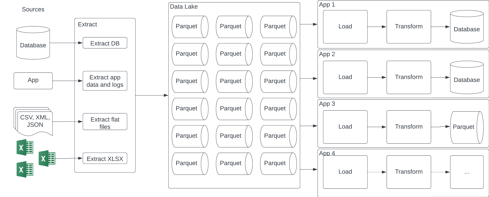
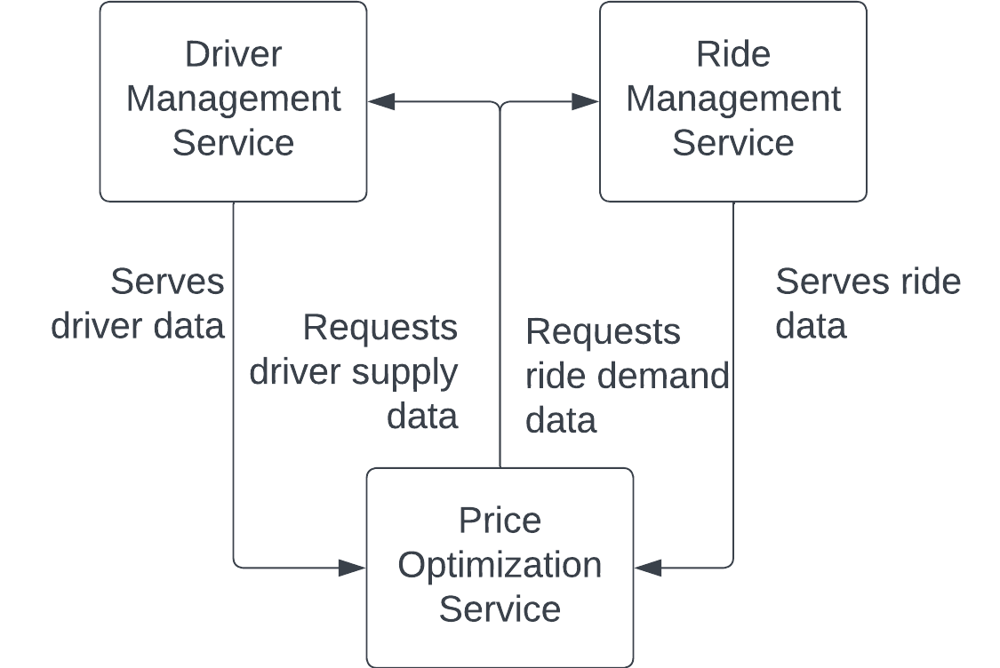
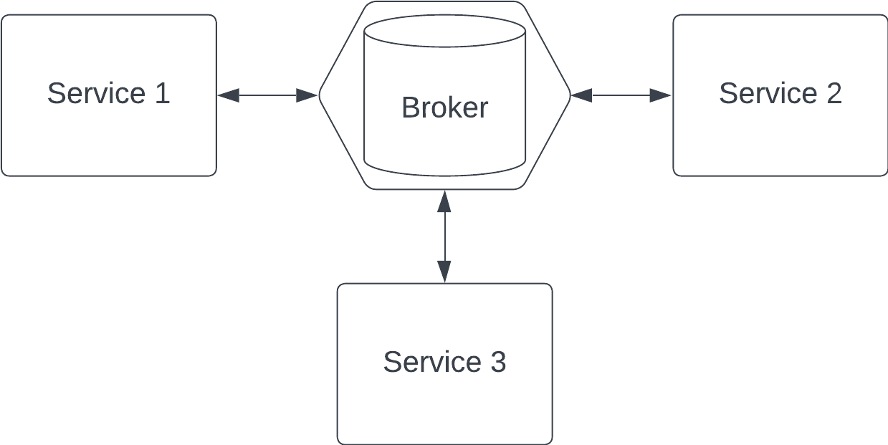

# Introduction

## Agenda

::::::{.columns}
:::{.column}

**2.1 Data Engineering Fundamentals**

+ Data Sources
+ Data Formats  
+ Data Models 
+ Data Storage and Processing
+ Modes of Data Flow

:::
:::{.column}


**Technical: An Initial Data Flow**

+ Download large data set
+ Setup virtual environments
+ Write code to load it in dask
+ Write code to write parquet files in dask
+ Naming convention

:::
::::::

# Data Sources

## Why Now?

::::::{.columns}
:::{.column}


:::
:::{.column}


:::
::::::

## Data Sources

::::::{.columns}
:::{.column}

+ Different data sources have different characteristics.
+ User input data:

    - Data that is explicitly input by users.
    - Text, images, videos, files, etc.
    - Prone to error: text too long, too short, incomplete, unexpected data types, etc.

+ System generated data:

    - Logs, performance metrics, and other system outputs.
    - Generally, well-formatted.
    - Can grow rapidly.


:::
:::{.column}

+ Databases generated by (internal) services and enterprise applications:

    - Many times, structured data.
    - Varying degrees of data quality.

+ Third-party data:

    - Data collected from the public, when the public is not a customer of the collecting organization.
    - Price databases, news aggregators, etc.


:::
::::::

# Data Formats

## Data Formats

::::::{.columns}
:::{.column}

+ Data storage is a fundamental component in any ML system:

    - Store raw input data. 
    - Store pre-computed features. 
    - Store model performance metrics and other model-related information.
    - Store logs for monitoring and debugging.

+ Multiple storage types can be combined with data transformation proceudres to create *pipelines*.


:::
:::{.column}

+ Selecting the right data format for storing can be beneficial in terms of performance and costs. 
+ *Data serialization* is the process of converting a data structure or object state into a format that can be stored or transmitted and reconstructed later.
+ Data formats can be:
    - Text or binary-based. 
    - Human readable. 
    - Row-major or column-major.

:::
::::::


## Some Common Data Formats

|Format |Binary/Text    |Human-readable |Example use cases|
|-------|---------------|---------------|-----------------|
|JSON   |Text           |Yes            |Everywhere|
|CSV    |Text           |Yes            |Everywhere|
|Parquet|Binary         |No             |Hadoop, Amazon Redshift|
|Avro   |Binary primary |No             |Hadoop|
|Protobuf|Binary primary|No             |Google, TensorFlow (TFRecord)|
|Pickle |Binary         |No             |Python, PyTorch serialization|


## JSON

::::::{.columns}
:::{.column}

+ JavaScript Object Notation.
+ Human-readable.
+ Implements a key-value pair paradigm that can handle different levels of structured-ness.
+ A popular format.

:::
:::{.column}

)](./img/json_object.png)

:::
::::::


## JSON is Flexible

::::::{.columns}
:::{.column}

Consider the record below. 

```
{
  "firstName": "Boatie",
  "lastName": "McBoatFace",
  "isVibing": true,
  "age": 12,
  "address": {
    "streetAddress": "12 Ocean Drive",
    "city": "Port Royal",
    "postalCode": "10021-3100"
  }
}
```
:::
:::{.column}

The data can also be represented with less structure.

```
{
  "text": "Boatie McBoatFace, aged 12, is vibing, at 12 Ocean Drive, Port Royal, 
           10021-3100"
}
```
:::
::::::

## Row-Major vs Column-Major Formats

::::::{.columns}
:::{.column}

**Row-Major Format**

+ Consecutive elements in a row are stored next to each other.
+ Example: CSV (Comma-Separated Values in a text file).
+ Accessing rows will tend to be faster than accessing columns.
+ Faster for writing additional records. 


:::
:::{.column}

**Column-Major Format**

+ Consecutive elements in a column are stored next to each other.
+ Example: parquet.
+ Accessing columns will tend to be faster than accessing columns.
+ Faster for retrieving columns.

:::
::::::

## Row-Major vs Column-Major (Huyen, 2022)


## Text vs Binary Formats

::::::{.columns}
:::{.column}

+ CSV and JSON files are stored as text files and are usually human-readable. 
+ Non-text file formats are called *binary*.

:::
:::{.column}

+ Binary files are more compact:

    - To store the number 1000000 would require 7 characters or 7 bytes (at 1 character per byte).
    - To store 1000000 as int32 would require 32 bits or 4 bytes.

:::
::::::

# Data Models

## Relational Model

::::::{.columns}
:::{.column}


:::
:::{.column}

+ Invented by Edgar F. Codd in 1970 in "A Relational Model of Data for Large Shared Data Banks"
+ Data is organized into relations.
+ Each relation is a set of tuples.
+ A table is a visual representation of a relation: each relation is a set of tuples.
+ Relations are unordered: we can shuffle rows or columns while retaining the relation.
+ Data following the relational model are usually stored using CSV, parquet, and (some types of) databases.

:::
::::::

## Normalization

::::::{.columns}
:::{.column}


:::
:::{.column}

+ Normalization is the process of determining how much redundancy exists in a table and reducing it, as required. 
+ The goals of normalization are to:

    - Be able to characterize the level of redundancy in a relational schema.
    - Provide mechanisms for transforming schemas in order to remove redundancy

+ Generally, we want to minimize redundancy of primamry and foreign keys.
+ One disasdvantage of normalizing data is that it becomes spread out in different tables.

:::
:::::::

## Query Language 

:::::::{.columns}
:::

+ A query language can be used to specify the data that you want from a database. 
+ SQL is the most popular query language. 
+ SQL is a declarative language.
+ Optimizing queries is the hardest part. 

:::
:::{.column}

+ An *imperative language* requires the programmer to determine the steps that the program should follow. For example, Python.
+ A *declarative language* requires the programmer to specify the outpus and the computer figures out the steps needed to get the queried outputs.  

:::
::::::

## No SQL

::::::{.columns}
:::{.column}

+ Relational model has been applied to many use cases, but can be restrictive: data needs to adhere to a schema.
+ Not Only SQL.
+ No SQL models can be of two types:

    - Document model.
    - Graph model.

:::
:::{.column}

+ The document model targets use cases in which data is assumed to come in self-contained units called documents. There is little relationship between the documents. 
+ The graph model targets use cases in which relationships are common and important. 


:::
::::::


## Document Model

::::::{.columns}
:::{.column}

+ Document is most times a long continuous string, encoded as JSON, XML, or BSON (Binary JSON).
+ All documents are encoded in the same format. 
+ Each document has a unique key that represents that document, which can be used to retrieve it.
+ Schema-less: document does not enforce a schema.
+ Schema on read: document databases shift the responsibility of assuming structures from the application that writes the data to the application that reads the data.
+ Use cases: documents, images, video, audio, unstructured data.

:::
:::{.column}

If a row in the relational model is somewhat equivalent to a document, then a table is equivalent to a
collection of documents.

```
{
  "Title": "Harry Potter",
  "Author": "J .K. Rowling",
  "Publisher": "Banana Press",
  "Country": "UK",
  "Sold as": [
    {"Format": "Paperback", "Price": "$20"},
    {"Format": "E-book", "Price": "$10"}
  ]
} 

```
Document1: harry_potter.json 

(Huyen, 2022)


:::
:::::::

## Graph Model

:::::::{.columns}
:::{.column}

+ A graph consists of nodes and edges.
+ Edges represent relationship between nodes.
+ In this model, the relationships between nodes is the priority.
+ Faster to retrieve data based on relationships. 
+ Use cases: social interactions, payments, risk exposures, transmission, communications, connectivity, references.

:::
:::{.column}

)](./img/matrix_network.png)

:::
::::::


## Graph Model

::::::{.columns}
:::{.column}

)](./img/comics_network.png)

:::
:::{.column}

+ Graph models enable network or graph metrics: 

    - Node metrics like centrality measures: degree, eigen, betweenness.
    - Graph-level features: cliques, clusters, modularity.

+ Graph databases may bundle other features (visualisation). 

:::
:::::::


## Structured vs Unstructured Data

::::::{.columns}
:::{.column}

**Structured Data**

+ Structured data follows a predefined data model called a schema.
+ Schema on write: by using structured data we commit to a predefined schema. Business requirements change over time, commiting to a predefined schema may be too restrictive.
+ Data warehouse: a repository for structured data.

:::
:::{.column}

**Unstructured Data**

+ Schema on read: unstructured data  does not adhere to a predefined schema, pushing the responsibility of applying a schema to the application that reads the data.
+ Key-value pairs: even if no schema is enforced, the data may contain intrinsic patterns that help extract structures.
+ Data lake: a repository for unstructured data.

:::
::::::

## Structured vs Unstructured Data


|Structured data |Unstructured data|
|----------------|-----------------|
|Schema clearly defined |Data does not need to follow a schema|
|Easy to search and analyze |Fast arrival|
|Can only handle data with a specific schema |Can handle data from any source|
|Schema changes will cause a lot of troubles |No need to worry about schema changes (yet), as the worry is shifted to the downstream applications that use this data|
|Stored in data warehouses |Stored in data lakes|

# Data Storage and Processing

## Data Storage and Processing

::::::{.columns}
:::{.column}

+ Databases are storage engines, an implementation of how data is stored and retrieved on machines.
+ Typically, databases are optimized for transactional processing or analytical processing.
+ A transaction is any kind of action: buy/sell, a tweet, ordering a ride, uploading a new model, watching YouTube.
+ On-Line Transaction Processing (OLTP): transactions are inserted into the database as they are generated. Occassionally, they can are updated. 

:::
:::{.column}


+ Transactional databases are designed to maintain low latency and high availability.
+ Transactional databases usually offer ACID guarantees:

    - Atomicity: all steps in a transaction are completed successfully as a group. If one step fails, all fail.
    - Consistency: all transactions coming through must follow predefined rules.
    - Isolation: two transactions happen at the same time as if they were isolated. Two users accessing the same data, will not change it at the same time.
    - Durability: once a transaction has been committed, it will remain committed even in the case of system failure.

+ Some transactional databases do not offer ACID, but BASE: "Basically Available, Soft state, and Eventual consistency." (Kleppmann, 2017)

:::
::::::


## Transactional vs Analytical DB

::::::{.columns}
:::{.column}

+ Because transactions are processed as a unit, transactional databases tend to be row-major. They will not generally be the most efficient for questions such as "What is the average price for all rides in September in San Francisco?"
+ Analytical databases are efficient with queries that allow us to look at data from different viewpoints. They are usually called On-Line Analytical Processing (OLAP).


:::
:::{.column}

 OLTP and OLAP are terms falling out of use, since the devide is somewhat outdated:

1. The separation was due to technological limitations: transactional databases that can handle analytical queries efficiently (e.g., CocroachDB)
2. Some solutions now decouple storage and compute (BigQuery, Snowflake, IBM, Teradata).
3. "Online" is now an overloaded term that can mean many things.

:::
::::::

## ETL: Extract Transform, and Load

::::::{.columns}
:::{.column}

ETL is the process of extracting data from one or several sources, transforming it to the shape that an application or model requires it, and loading it to a desired destination.
    
- Extract the data from all data sources, including validation and rejecting data that does not meet rquirements. Notify sources of rejected data.
- Transform the data through different operations: join, filter, standardization, etc.
- Load is deciding how and how often to load the transformed data into the destination, which can be a file, a database, or a data warehouse.

:::
:::{.column}

+ Schema on read forces app developers to determine the schema in advance.
+ Data acquisition grows rapidly and storage is inexpensive.
+ Some companies invested in a store-all-the-data strategy.

:::
::::::

## ETL Pipeline


## ELT: Extract, Load, and Transform

::::::{.columns}
:::{.column}

+ Solves the problem of rapidly arriving data.
+ Store first, figure out what to do with the data later.
+ Use a compressed format.
+ Take advantage of clusters of computers and cloud.

:::
:::{.column}

+ Also difficult to manage.
+ Inefficient to search through a massive amount of raw data for the data that you want.
+ As infrastructure and frameworks become standardized, data is also becoming standardized.
+ Lakehouse solutions (Databricks and Snoflake) are hybrid solutions that combine the flexibility of data lakes and the data management of data warehouses.

:::
::::::

## ELT Pipeline




# Modes of Data Flow

## Modes of Data Flow

::::::{.columns}
:::{.column}

+ Data 'flows' when data is passed from one process to another.
+ In production, generally we do not see data flows in the context of a single process, instead we find multiple processes.
+ How do we pass data between processes that do not share memory?


:::
:::{.column}

**Modes of Data Flow**

+ Data passing through databases.
+ Data passing through services using requests such as the requests provided by REST and RPC APIs (e.g.,  POST/GET requests).
+ Data passing through a real-time transport like Apache Kafka and Amazon Kinesis.

:::
::::::

## Data Flows 1: Data Passing Through DBs

::::::{.columns}
:::{.column}


:::
:::{.column}

+ Process 1 writes to DB, Process 2 reads from DB.
+ Considerations:

    - Both processes must be able to access the same database.
    - Both processes to access data from databases and read/write from databases can be slow: potentially not suitable for apps with strict latency requirements (consumer-facing applications, for example).

:::
::::::


## Data FLows 2: Data Passing Through Services

::::::{.columns}
:::{.column}



:::
:::{.column}

+ Send data directly through a network:

    - Process A sends a request to Process B, specifying the data it needs.
    - Process B returns the requested dta through the same network.

+ Request driven approach.
+ Service oriented architecture:

    - Each one of the services can belong to different companies.
    - Two services can also be parts of the same application (microservices architecture).

:::
::::::

## Data FLows 2: Data Passing Through Services (cont)

::::::{.columns}
:::{.column}


:::
:::{.column}

+ Popular frameworks for communication among services are:

    - REST: representational state transfer. Popular among public APIs. HTML is an implementation of REST.
    - RPC: remote procedure call. Aims to make service requests look like internal function calls.

+ In complex scenarios (all services request and serve data, for instance), this architecture may become overly complex.
+ A better approach may be to have a central data broker.

:::
::::::

## Data FLows 3: Data Passing Through Real-Time Transport

::::::{.columns}
:::{.column}



:::
:::{.column}

+ Request-driven data passing is synchronous: the target service must be listening for the request to go through.
+ A broker can coordinate passing data among services instead of creating a complex web of interservice data passing.
+ Whenever a service produces data (a prediction, for example), it is passed to the broker. Whichever service requires the most recent version of the data, it can find it with the broker.
+ Technically, databases could be real-time transports, however it can add latency. If this is a conern, an in-memory transport is preferred.

:::
::::::


## Events and Types of Real-Time Transports

::::::{.columns}
:::{.column}

+ A piece of data broadcast to a real-time transport is called an event.  
+ This architecture is called event-driven. 
+ The real-time transport is sometimes called event bus.
+ Request-driven architecture works well for systems that rely more on app logic than on data.
+ Event-driven architecture works better for systems that are data-intensive.


:::
:::{.column}

+ Two most common Real-Time Transports are pubsub (publish-subscribe) and message queue.
+ In the pubsub model:

    - Any service can publish to different topics in the real-time transport. - Any service that subscribes to a topics can read all the events in that topic. 
    - There is a retention policy, for example: data will be retained for X days before being deleted or moved to permanent storage.
    - Examples: Apache Kafka and Amazon Kinesis.

+ In the message queuue model:

    - An event has intended consumers. An event with intended consumers is a message.
    - The message queue is responsible for getting the message to the right consumers.
    - Examples: Apache RocketMQ and RabbitMQ.

:::
::::::


## Batch Processing vs Stream Processing

::::::{.columns}
:::{.column}

+ Once data arrives in a data storage engine (database, data lake, or data warehouse, for example), it is historical data.
+ Historical data is processed in batch jobs that are run preiodically.
+ Batch processing is a practice with mature solutions such as MapReduce and Spark. 
+ Stream processing is performing computation on streaming data coming from real-time transports.

:::
:::{.column}

+ Computation can also be started periodically, but the periods are generally shorter. Computation could also be started when the need arises.
+ Batch processing is usually performed on slow-changing variables known as static features (for example,  daily metrics).
+ Streaming processing is performed on rapid-changing variables known as dynamic features (for example, average metric in past 5 minutes).
+ Example products: Apache Flink, KSQL, and Spark Streaming.

:::
::::::