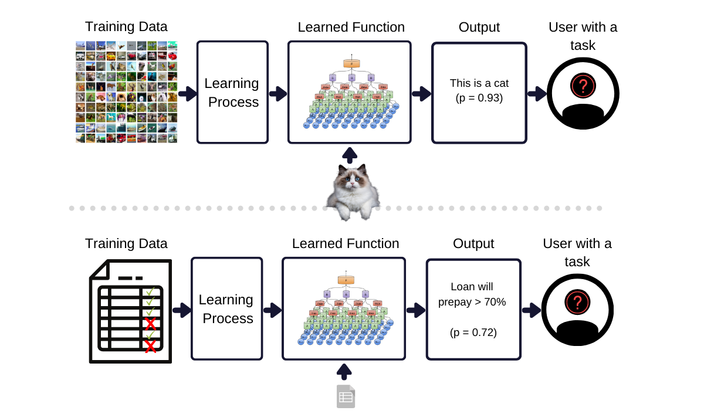

# ML Systems in Production
## Session 1: Introduction

Jesús A. Calderón
February 2024

# Introduction

## Agenda

::::::{.columns}
:::{.column}

**Course Introduction**

**1.1 Overview of ML Systems**
	
+ When to Use ML
+ ML in Production
+ ML vs Traditional Software

**1.2 Introduction to ML System Design**
	
 + Business and ML Objectives
 + Requirements of Data-Driven Products
 + Iterative Process
 + Framing ML Problems 

::: 
:::{.column}

**Assignment: Setting Up a Code Repository**

 + Sign up for a GitHub Account
 + Install Git.
 + Setup SSH Key.
 + Setup repo and do an initial commit.

:::
::::::

## ML: An Illustration

## ML: An Illustration

## What is ML?

::::::{.columns}
:::{.column}

“A computer program is said to learn from experience *E* with respect to some class of tasks *T* and performance measure *P*, if its performance at tasks in *T*, as measured by *P*, improves with experience *E*.”

(Mitchel, 1997)

:::
:::{.column}

## What is ML?

Machine Learning (ML) is a collection of methods that allow a computer to:

+ **Learn autonomously** to perform a task based on patterns in a set of examples without being explicitly programmed.
+ **Gain from experience** such that the method performs better in the measure that it observes additional examples.
+ **Generalize results** beyond the data used for training the method.

:::
::::::

## Why Use Machine Learning?

::::::{.columns}
:::{.column}

+ ML is used when a task is too complex or too impractical to program explicitly.
+ When applied successfully, ML will enable:

    - Greater scale: automation.
    - Better performance.
    - Doing things that were not possible before.

:::
:::{.column}

 ([Image source](https://www.augmentedstartups.com/blog/overcoming-challenges-in-object-detection-accuracy-speed-and-scalability))

:::
::::::

## When to Use ML?

## ML in Production

## ML vs Traditional Software

## Business and ML Objectives

## Requirements of Data-Driven Products

## Iterative Process

## Framing ML Problems

